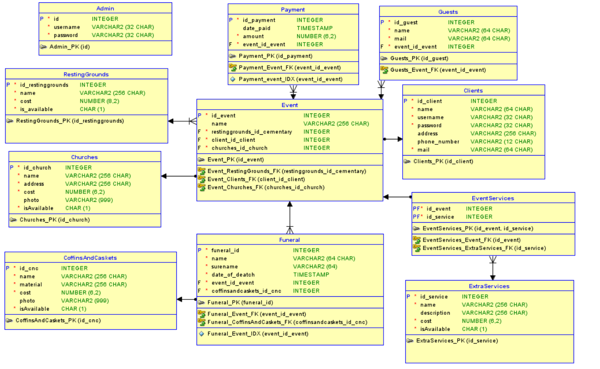

# Funeral Home Ordering System - LifeSeQueL

Authors: Jan Chlebek

Planing, development and implementation of the main project took about 5 days (1.5 of which is the application implementation itself)

SQL files created during classes are included in subfolder

## Setup

Target system: Microsoft Power Apps Canvas + Azure SQL database

1. Create Azure SQL database instance
2. Run `SQL_database_generator.sql` in your own database
3. Import `LifeSeQueL.zip` file as Canvas App
4. Add connections to all created tables in your app and publish it as standar Power App or Teams App.
5. Sample client credentials: client client, sample admin credentials: admin, admin

## Project photos
- Database relational diagram

- login screen

- New account form

- User order form

- User menu main view

- Admin menu main view

- Admin SQL table editor

